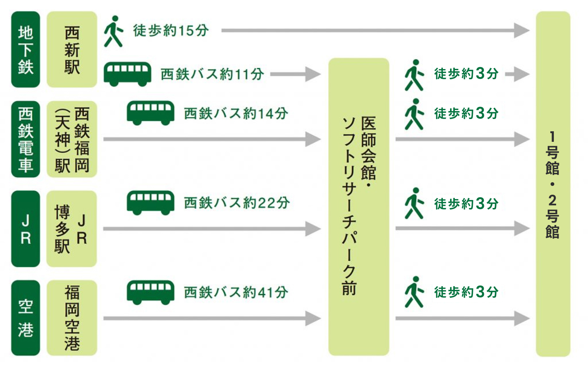

# 第37回 九州臨床神経生理研究会

## 開催日時

2026年8月22日(土) 11:00~

## 開催場所：ハイブリッド開催: teams+[福岡国際医療福祉大学福岡キャンパス2号館](https://maps.app.goo.gl/v5J7YdbX7EBCAYQaA) (福岡市早良区百道浜２丁目４−１６)

- 会場：8階 (暫定)

### アクセス

- 地下鉄でお越しの場合
  - 地下鉄空港線「西新」駅から西鉄バス約11分、「医師会館・ソフトリサーチパーク前」
    - バス停下車徒歩約3分（徒歩の場合、「西新」駅から約15分）

- 西鉄電車でお越しの場合
  - 西鉄天神大牟田線「西鉄福岡（天神）」駅から西鉄バスで約14分、
    - 医師会館・ソフトリサーチパーク前」バス停下車徒歩約3分

- JRでお越しの場合
  - JR鹿児島本線「博多駅」から西鉄バスで約22分、
    - 「医師会館・ソフトリサーチパーク前」バス停下車徒歩約3分

- 空港でお越しの場合
  - 福岡空港から西鉄バスで約41分、
    - 「医師会館・ソフトリサーチパーク前」バス停下車徒歩約3分

## 当番世話人

後藤純信 (国際医療福祉大学医学部 生理学教室)

## プログラム

|時間|プログラム|タイトル|
|----|----|----|
|10:30|開場||
|11:00 - 11:05|開会挨拶|後藤 純信 (国際医療福祉大学医学部)|
|11:05 - 11:15|一般演題|圧センサーアレイによるTMSコイル中心の頭皮への設置状態のリアルタイムフィードバック||
||演者|緒方勝也 (国際医療福祉大学 福岡薬学部)|
||座長||
|11:15 - 11:50|教育講演1|タイトル||
||講師|蜂須賀 明子 (産業医科大学若松病院 リハビリテーション科)|
||座長||
|11:50 - 12:50|特別講演1|ニューロモデュレーションによる神経疾患治療の現状と未来|
||講師|白石秀明 (獨協医科大学 小児科)|
||座長|後藤純信  (国際医療福祉大学医学部)|
|12:50 - 13:40|昼休み||
|13:40 - 14:15|教育講演2|タイトル|
||講師|日高茂暢 (佐賀大学 教育学部)|
||座長||
|14:15 - 15:20|特別講演2|タイトル|
||講師|白水洋史 (福岡山王病院 脳神経外科)|
||座長|緒方勝也 (国際医療福祉大学 福岡薬学部)|
|15:20 - 15:55|教育講演3|タイトル: 発作症状からみた脳機能局在 - Stereo-EEGの経験から -|
||講師|萩原綱一 (福岡山王病院 神経内科) |
||座長||
|16:10 - 16:55|ハンズオンセミナー|明日からの臨床に活かす神経伝導検査ハンズオン|
||講師|吉富博人 (飯塚病院 中央検査部)|
||座長||
|16:55 - 17:05|ビジネスミーティング|緒方勝也|
|17:05|閉会||

